# Pycharm从0到1

- 前提:作者使用的是Pycharm Professional.会有一些东西和基础版有所出入,注意辨别.

**Pycharm主页**：<https://www.jetbrains.com/pycharm/>

# 初识 `Pycharm`

+ 欢迎界面

+ Project

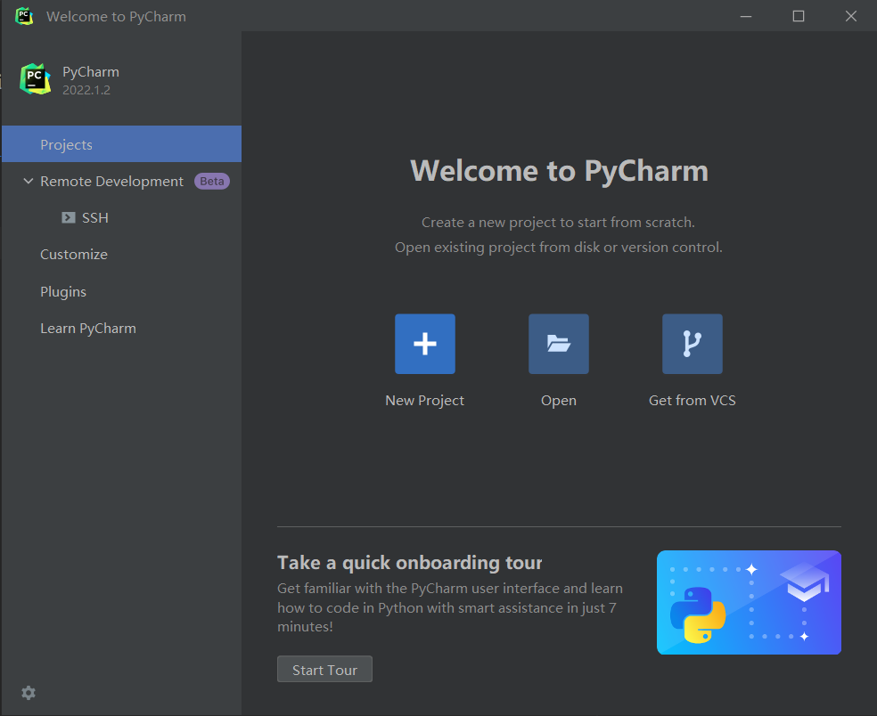

|             选项              |    功能     |
|:---------------------------:|:---------:|
|      |  建立新的项目   |
|  |  打开现有的项目  |
|  | 从版本控制获取项目 |

+ Remote Development `Beat`

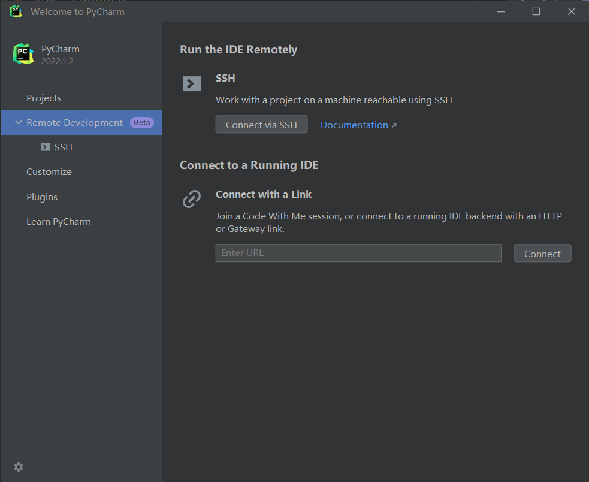

pass

+ Customize

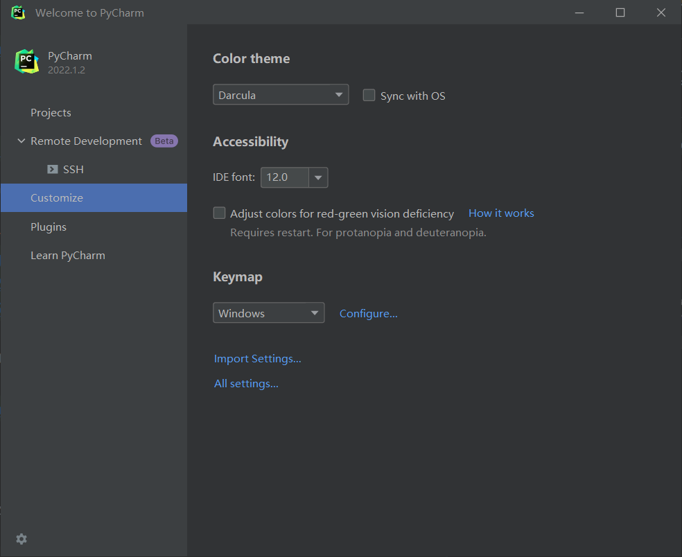

|                     Color theme                      |                                         Accessibility                                          |                    Keymap                     |
|:----------------------------------------------------:|:----------------------------------------------------------------------------------------------:|:---------------------------------------------:|
|   `Intellij Light` 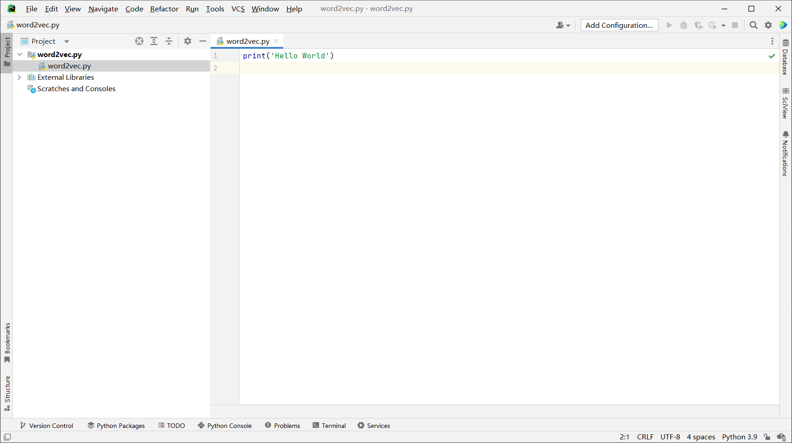   | `IDE font` 调节字体大小  `Adjust colors for red-green color vision deficiency` 对红绿色盲进行辅助 |  可以设置不同快捷键方案 |
| `Windows 10 Light` 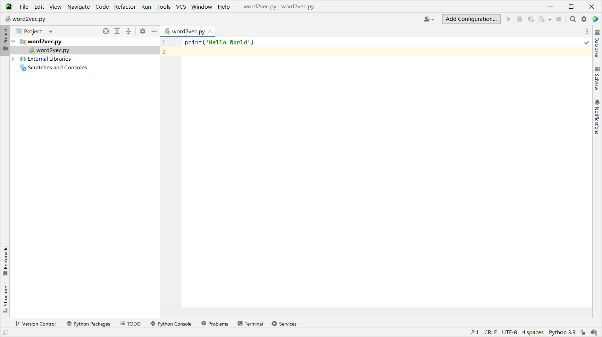 |                                             开启前后对比                                             |           `Configure `  自定义快捷键            |
|     `Durcula` 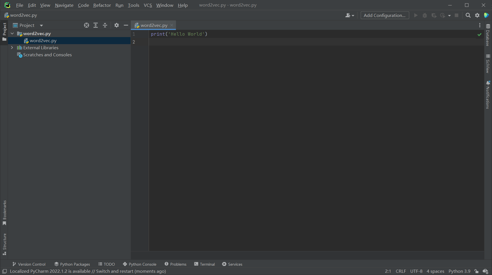      |                                 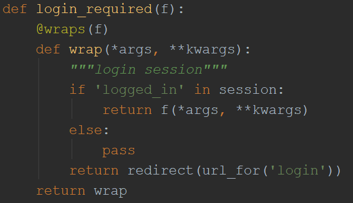                                  |       `Importing Settings` 导入已备份的设置       |
|  `High Contrast` 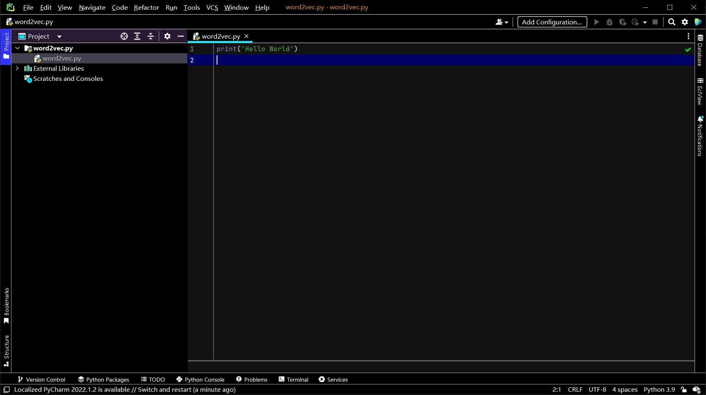   |                                 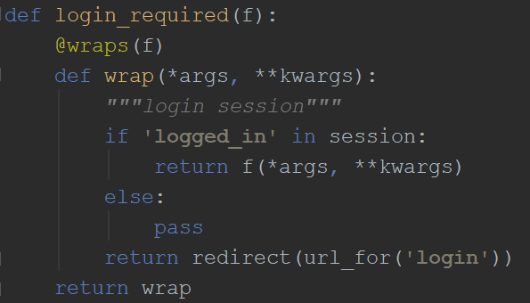                                  |   `All Settings` 点击此选项可打开`Pycharm`的所有设置   |

+ Plugins

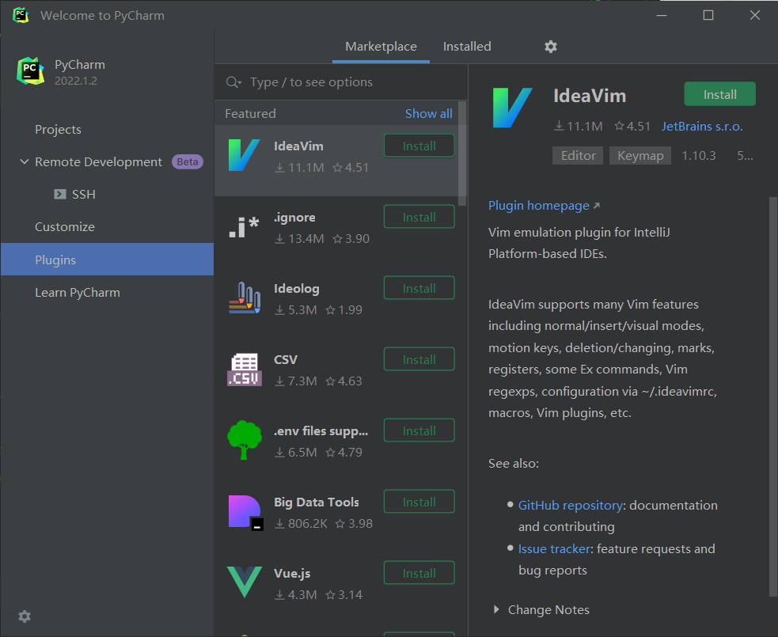

- 下载插件的步骤
    1. 点击 `Marketplace`
    2. 在 `Type / to see options` 处输入想搜索的插件
    3. 选择适合的产检点击 `Install`
- 查看已安装插件的步骤
    1. 点击 `Installed` 便可在中间栏查看已安装的插件 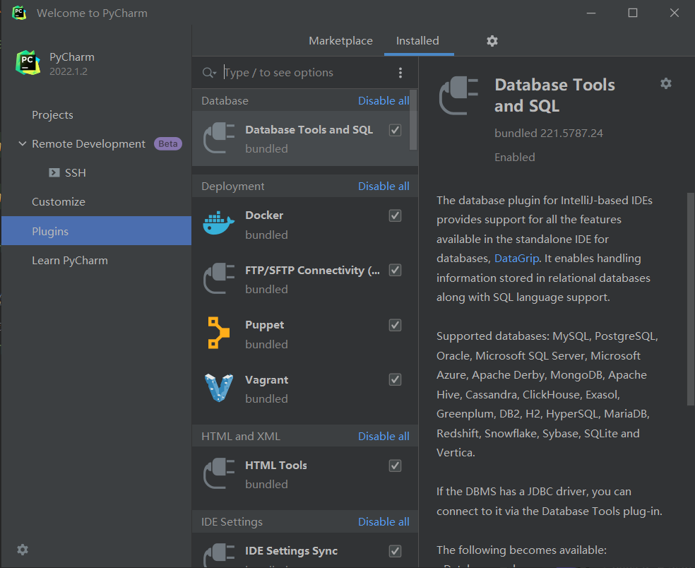
- 禁用或卸载插件的步骤
    1. 利用上方步骤的基础上选中要卸载的插件
    2. 右键该插件 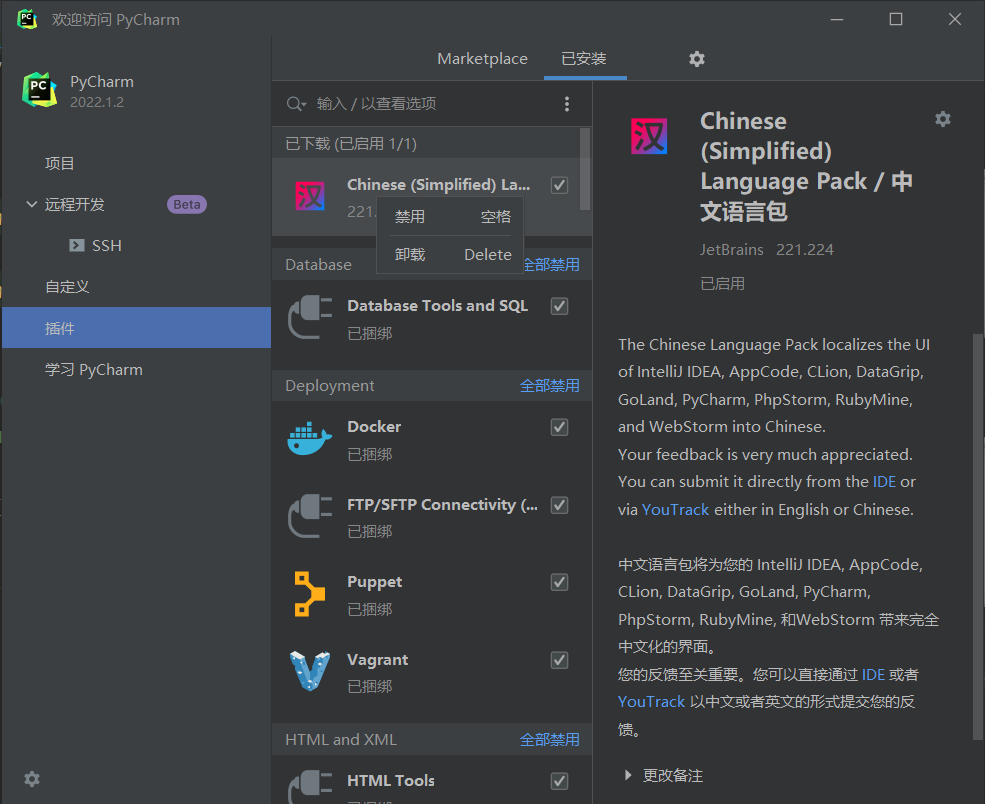
    3. 选择 `Disabled(禁用)` 或者 `Uninstall(卸载)`

- 齿轮部分后续补充